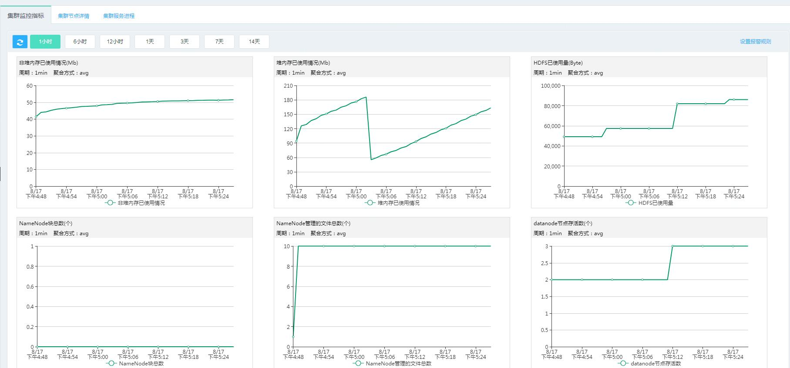
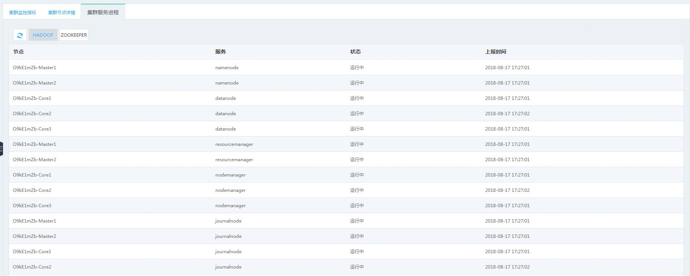

#Cluster monitoring

This article describes how to configure cluster monitoring.

## Operation Steps
1. Log in to the [JD MapReduce Console](https://xdata.jdcloud.com/rmgr/resources/res-manage/custom-resources.html#/) and select which cluster to view.

2. Select the cluster you want to view and the corresponding monitoring in the operation.

3. The "Monitoring" page has the following three parts:
 -  Cluster monitoring indicators (10 monitoring indicators, including hadoop and yarn)
 
 
 -  Cluster node details (cluster is composed of multiple VM instances, and instances refer to virtual machine. You can view the monitoring status of an instance by searching for the host name in Management - Cloud Monitoring - Virtual Machine. You can also click the virtual machine name on the following page to jump to VM Monitoring. )
 
 
 -  Cluster service process (showing the service status of the application layer node)
 
 
 

	   

