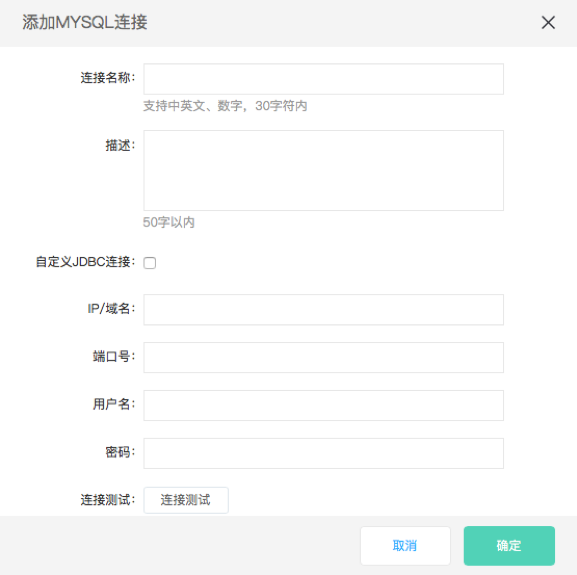

# Configure MySQL Data Sources

The MySQL relational database data-source provides the ability of read Mysql and can configure the synchronization tasks.

**Operation Steps:**

1.        Enter the data factory; click ‘Connection Management’; select ‘Add Connection’;

2.        Select the type of data source ‘MYSQL’;

Configuration Item Description:

​    **Connection Name**: Consisting of Chinese text, English text, numbers and underline, with no more than 30 characters in length;

​    **Description**: A simple description of the data source, with no more than 50 characters;

​    **Customized JDBC Connection**: Whether to use the connection method of JDBC or not;

​    **IP/****Domain Name**: Fill in the connection information;

​    **Port Number**: Fill in the connection information;

​    **User Name/Password**: The username and password corresponding to the database.

3.        Click ‘Connection Test’;

4.        After the connection test is passed, click ‘OK’.