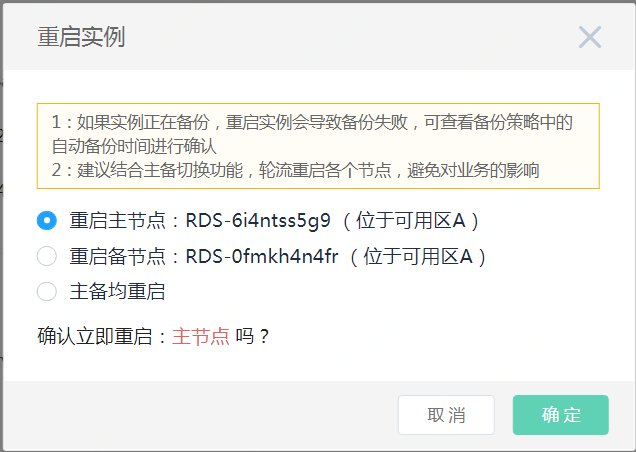

# Reboot Instance

## 1. Operation Entrance
There are three entries to reboot the instance:

- [Reboot] under the [Operation] menu on the right side of each instance in the instance list page.
- [Reboot] under the [Operation] menu at the top right of the instance detailed page
- The instance detailed page is shown below

## 2. Select Nodes to be Rebooted
Users can reboot the primary or standby nodes separately or reboot them at the same time. In default condition
- Select the restart for the primary node by default after clicking the primary node.
- Select the restart for the standby node by default after clicking the standby node.
- The restarts under the operation menu are not selected by default.

If users need to reduce the impact on the service during the restart, the failover function can be employed, for example
1. Perform the failover function
2. Restart the standby node (i.e., the original primary node).
3. Perform the failover function again (this step can be skipped if both the primary and standby nodes are in the same availability zone).

**Note: Both failover instances and rebooting instances will interrupt the ongoing backup, so users shall avoid to carry out these operation as far as possible when the backup is in progress.**

The start time of the backup can be viewed on the backup strategy page of the backup management. It is recommended to perform a full backup manually after the operation is completed, if it is necessary to operate while the backup is in progress.

