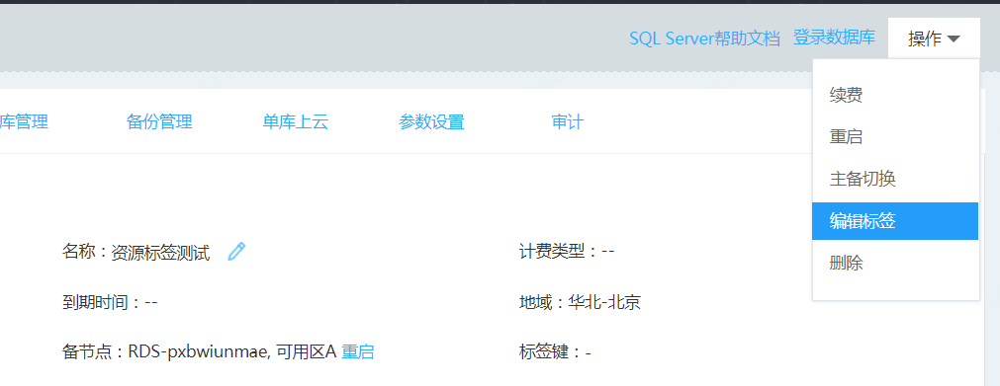

# Edit Tag
## 1. Operation Entrance
Select the database instance whose tag needs to edited and click [Edit Tag] in "More".

Or click the instance name to enter the instance detailed page and click [Operation] - [Edit Tag] in the upper right corner.

## 2. Edit Tag 
- In the "Edit Tag" pop-up window, the tag of the current instance is bound by default. If the current instance has 10 tags, the [Add] button will be grayed out.
- Users can select the corresponding tag key/value (Key-Value) according to the existing tags from the pull-down menu or after fuzzy matching according to the input and click [Add]. Then, it will display in the current tag.
- Click [OK] and the editing will be completed according to the display in the current tag, and it will be bound to the instance.
- Once the tag is edited, users can see if the tag was successfully edited from the list page/detailed page of the database.

## 3. Precautions
- The tag key (Key) of same resource cannot be repeated, and if the tag key (Key) is the same before and after editing and the value is different, the original value will be replaced by the new value.
- Edit tag will be triggered only by clicking [OK] instead of [Add].
- The system disassociates the unnecessary tags from the current instance, and then associates the new tags/replace the original tags during editing. Therefore, please edit tag again, if the disassociation is successful while the binding/replacing is not due to network jittering.
