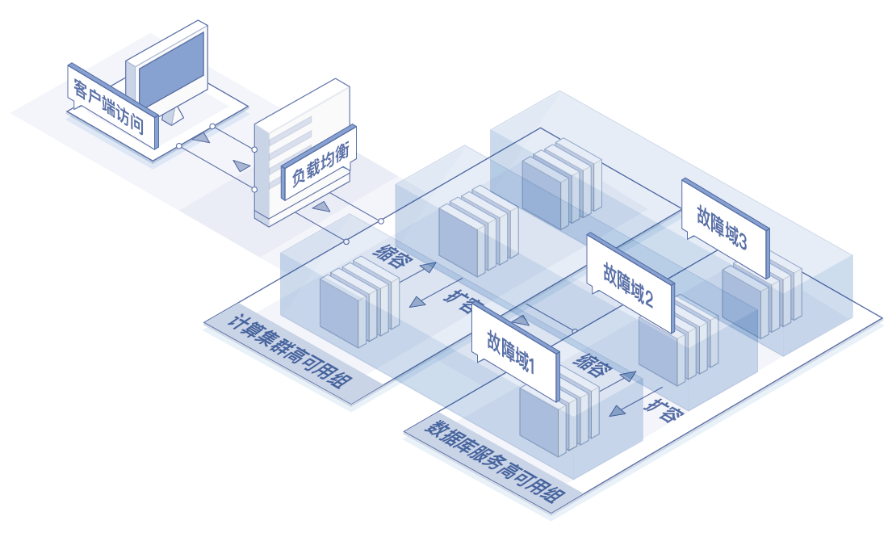

# Application Scenario

## Availability Web Application

* Scenario Description: Different service groups can be deployed with different Availability Groups to isolate the impact of service layer failures. JD Cloud Availability Group will ensure that the VMs instances corresponding to Web services are scattered over physical resources, and the VMs corresponding to database services are scattered over different physical resources. When the physical resource of a Web service VM fails, other Web service instances and database service instances will not be unaffected, and your business can be available.
* Recommended Configuration: The Web service instance uses an Availability Group, and the database service instance uses an Availability Group. The two Availability Groups span the Availability Zone.
* 

## Elastic High Performance Computing Applications

* Scenario Description: Computing requests arrive at the application server through load balancer. When your computing load fluctuates, you can configure alarm scaling strategy based on monitoring metrics to automatically trigger addition or deletion of VMs, guarantee cluster computing power, and save business deployment costs. If you can predict the amount of volatility, you can plan ahead the number of VMs available within the group and configure the timing scaling strategy to trigger addition or deletion of VMs regularly.
* Recommended Configuration: The cluster instance is calculated with an Availability Group, and an Availability Group is used for the database service instance. The two Availability Groups have automatic scaling functions.
* 
