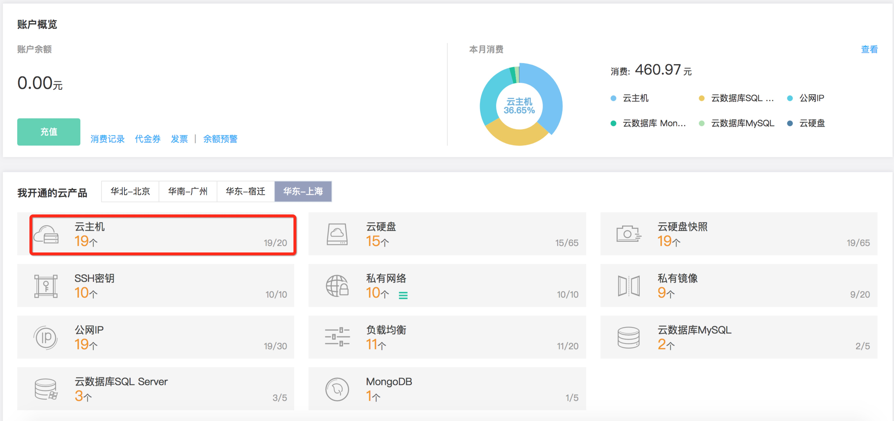
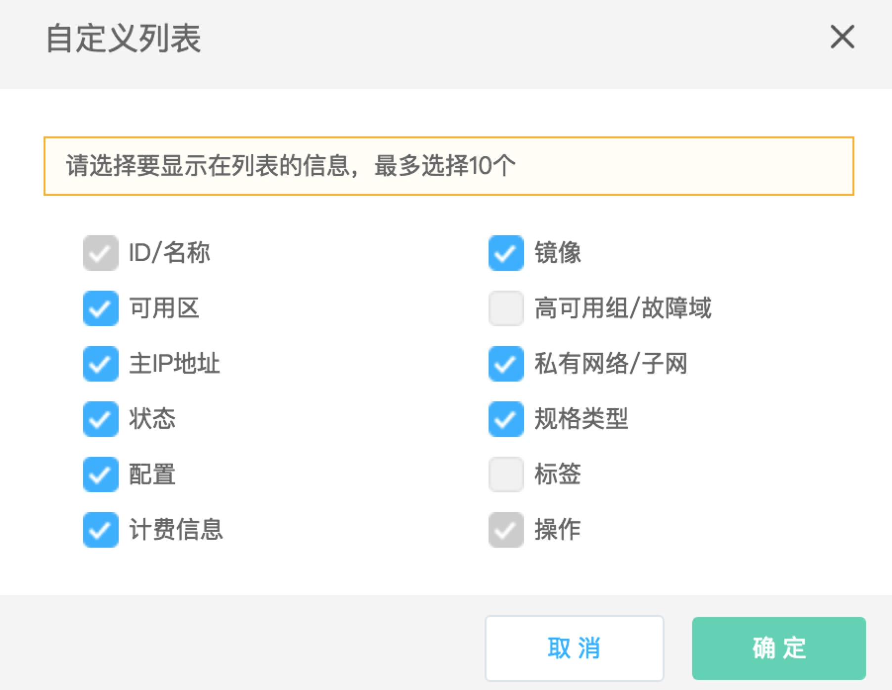

# View Instance

You can view the instances you have through the console:

* [Overview Page](#user-content-Overview Page): You can view the number of region instances and quota under the current account.
* [Instance List Page](#user-content-Instance List Page): You can view the information about all instances in each domain, including ID, name, Availability Zone, IP Address, and so on.
* [Instance Details Page](#user-content-Instance Details Page): You can view the details of the specified instance.

## Overview Page

[Overview Page](https://console.jdcloud.com) is the default home page for logging in to the JD Cloud console. You can view the number of region instances and quota in the current account. 

	
	

## Instance List Page

1. Access [Virtual Machine Console](https://cns-console.jdcloud.com/host/compute/list) and enter the instance list page. Or access [JD Cloud Console](https://console.jdcloud.com) Click navigation bar on the left [Elastic Compute] - [Virtual Machine] to enter the instance list page.
2. Select Region. 

	You can view the information about all instances in the selected territory, including ID, name, availability zone, IP address, and more. Since there are many instance information items, you can adjust the information items displayed on the instance list page through edit columns as needed. The detailed steps are as follows:

3. Click the edit columns on the top right corner of the instance list page icon 

4. In the pop-up window of the edit columns, select the information item you want to display and click [Confirm]. 

		Please note that: The current list supports up to 10 items of information.
		
You can also view related information from the instance list page to virtual private cloud, subnet, and availability group, etc. of instance.
	
## Instance Details Page

1. Access [Virtual Machine Console](https://cns-console.jdcloud.com/host/compute/list) and enter the instance list page. Or access [JD Cloud Console](https://console.jdcloud.com) Click navigation bar on the left [Elastic Compute] - [Virtual Machine] to enter the instance list page.
2. Select Regions.
3. In the instance list, select the instance for which you want to view the details, and click the instance name to go to the details page.

You can view the following instance information:

* Basic Information: ID, name, description, billing type, creation time, expiration time (monthly package billing type), region, availability zone, availability group, fault domain, label
* Configuration Information: image, specification, system disk, key pair
* Network Information: Virtual private cloud, subnet, private IP, public IP

You can also view the related information from the instance details page to virtual private cloud, subnet, the availability instance binding cloud disk service, the instance binding elastic network interface, the instance binding security group, and the instance monitoring alarm.
