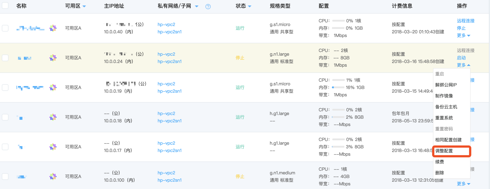

# Resize

At the beginning of the application, you can use lower specifications when the request volume is smaller, and you can quickly adjust the specifications when the application grows rapidly and the service request volume increases rapidly, thus improving the processing speed of the service and meeting your needs better.

## Precondition

* The instance must be in "Stopped" status. If the instance is in the "Running" status, please run [Stop Instance](Stop-Instance.md) first; if the instance is in other unstable status, please wait for the pre-order operation to complete before resizing.
	
		Please note that ::
		* The first generation Virtual machine is not allowed to be resized with the second generation virtual machine;
		* For virtual machine billing paid by configuration, after resizing, it will be billed according to the new specifications. The specifications will be immediately settled before resizing (that is, the bills incurred from the last settlement time to the current time will be settled);
		* For the monthly package billing virtual machine:
			* If the specification price after the resizing is lower than that before the resizing, the expiration time of virtual machine will be extended;
			* If the specification price after the resizing is higher than that before the resizing, you need to pay the difference before the expiration.

## Operation Steps
1. Access [Virtual Machine Console](https://cns-console.jdcloud.com/host/compute/list) and enter the instance list page. Or access [JD Cloud Console](https://console.jdcloud.com) Click navigation bar on the left [Elastic Compute] - [Virtual Machine] to enter the instance list page.
2. Select Regions.
3. In the instance list, select the instance that needs resizing and confirm that its status is "Stopped".
4. Click [Operate] - [More] - [Resize], or click instance name to enter the details page and click [Operate] - [Resize] to enter the resizing page.
 
5. Select the new instance type and click [Resize Now]. The resizing is triggered by the paid by configuration billing instance; for the monthly package instance, the payment needs to be paid, and the resizing is triggered after payment completion. 

After that, the instance will enter the "Resizing" status. After the resizing is completed, it will be restored to the "Stopped" status. After the "Start" instance is operated, the instance can be used normally.
## Related Reference

[Stop Instance](Stop-Instance.md)
