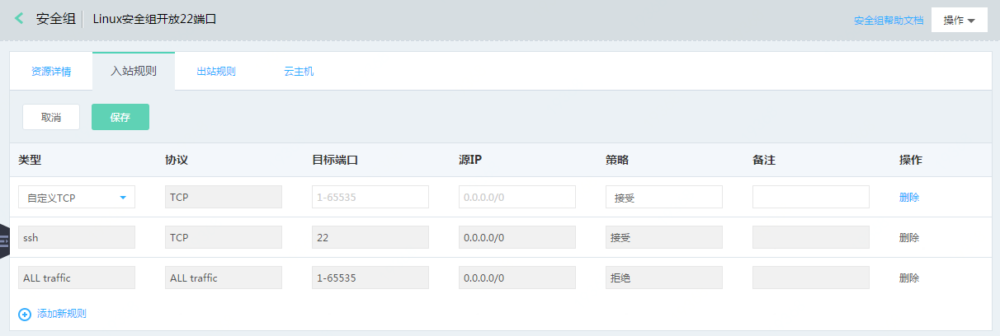

# Configure Security Group Inbound Rules
Inbound rules are used to filter network traffic from the cloud network or other virtual machines to access the current machine.

## Precautions
* Security group rules in the state. If you allow instance to send a request externally by configuring an inbound rule, the response traffic for that request will be allowed to flow regardless of the outbound rule configuration.
## Operation Steps
1. Access [Security Group Console][1], or access [JD Cloud Console][2] click the left navigation bar [Elastic Compute] - [Virtual Machine] - [Security Group] to enter the security group list page and find the security group that needs to be configured with inbound rules, click [Modify Inbound Rules] in [More] or click the security group name to jump to its details page.

2. Enter the Inbound Rules TAB page and click [Edit Rules] on the page to enter the Inbound Rules Edit page.

3. Click [Add New Rule] at the bottom of the page to add an inbound rule for the current security group. After you select the inbound rule type, the system will automatically match the corresponding protocol according to the selected inbound rule type, and set the port in turn. A single port number, such as 80, also supports port range (such as: 80-8080), destination IP (supports a single IP or CIDR), and notes (supports full characters, no more than 26 characters) to complete the configuration of an entry rule.
4. You can also edit the security group inbound rules that have been added on the page at any time.
5. Click [Delete] in the operate columns to delete a corresponding inbound rule.
6. After completing the inbound rule editing, click [Save] at the top of the page, and the newly modified security group rule will take effect automatically.

  [1]: ./images/Operation-Guide-SG-inbound1.png "Operation-Guide-SG-inbound1.png"
  [2]: ./images/Operation-Guide-SG-inbound1.png "Operation-Guide-SG-inbound1.png"
  [3]: ./images/Operation-Guide-SG-inbound1.png "Operation-Guide-SG-inbound1.png"
  [4]: ./images/Operation-Guide-SG-inbound2.png "Operation-Guide-SG-inbound2.png"
  [5]: ./images/Operation-Guide-SG-inbound3.png "Operation-Guide-SG-inbound3.png"