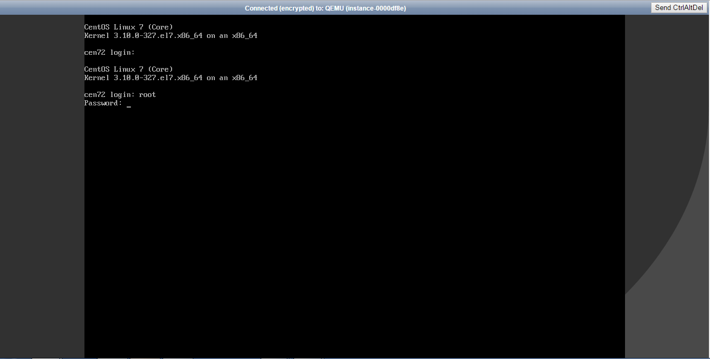
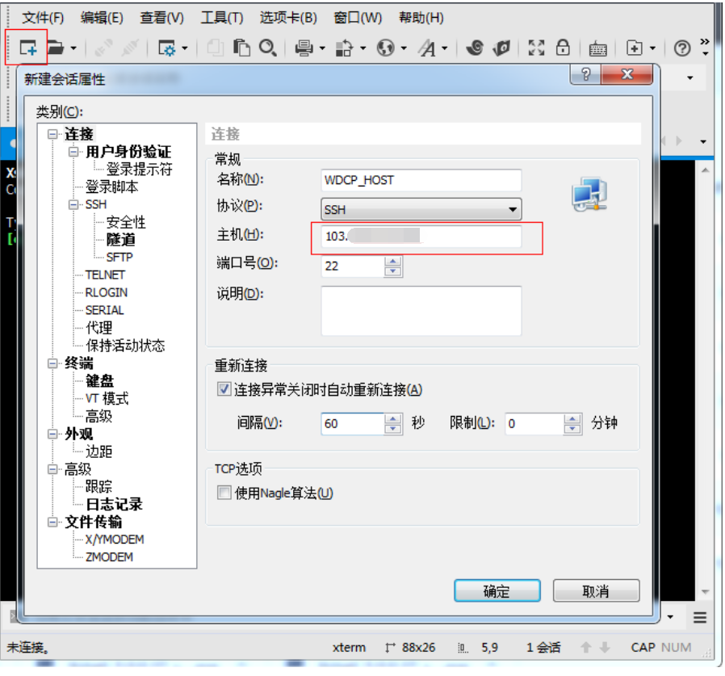
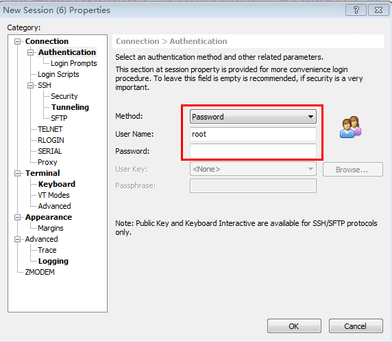
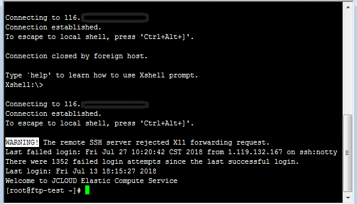
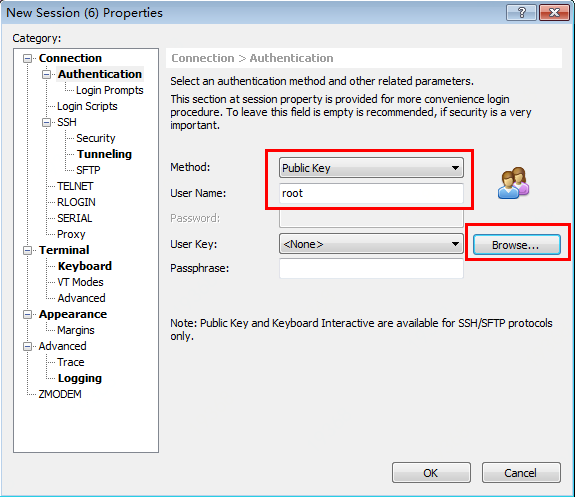
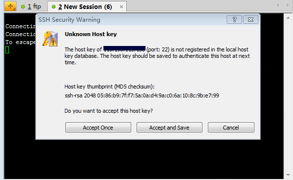
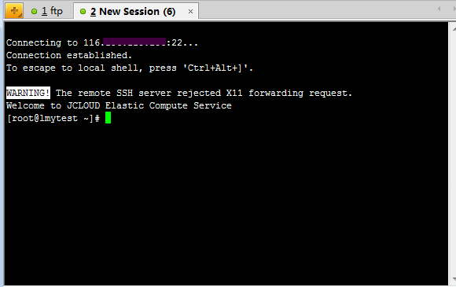

# Login Linux Instance
After purchasing and launching an instance of Linux type, you can choose to login the instance for relevant management. Depending on whether your local operating system and instance are accessible by the Internet, different login methods can be adopted in different situations. For details, please refer to the table below.
<table>
   <tr>
      <td> Type of Local Operating System</td>
      <td> Linux Instance Associated to Elastic IP  </td>
      <td> Linux Instance Not Associated to Elastic IP </td>
   </tr>
   <tr>
      <td> Wndows </td>
      <td> VVNC Login Use Password/ Key Pair to Login through Remote Login Software  </td>
      <td rowspan="2"> VNC Login</td>
   </tr>
   <tr>     
      <td> Linux / Mac OS</td>
      <td>VVNC Login Use Password/ Key Pair to Login   </td>
   </tr>
</table>

## Login Preparation
Create an instance and acquire the account number and corresponding password:

* Administrator Account: root
* Password: JD Cloud instance can obtain password in two ways.
  * When creating an instance, select **Set Later** and the system will send a default password by SMS and email. You can use the default password to verify when you login to the instance.
  * Select **Set Now**, and then you should enter a customized password in the password setting text box. If you forget the password, you can reset the password by [Reset Password](../Operation-Guide/Instance/Reset-Password.md). This function is only available for the "Running" instance.

## Use VNC to Login Linux Instance
VNC login is a way provided by JD Cloud for remote connection to instance for users via Web browser. In the case that a remote login client is not installed or the client remote login is not available, the user can connect to the instance through VNC login, observe the instance status, and perform basic instance management operations through the instance user.
The scenarios of VNC login include at least the following:
* View the starting progress of the instance
* When you cannot login through a remote login software or key pair, login to the instance through VNC login.

1. Click **Remote Connect** in the operation column of the Instance List to connect to the Linux instance via VNC.

2. Click **VNC** to enter the login page.
* Default Username: root        
* Password: The instance password set when you created the instance 

Please note:
* Under a same browser, only one instance can be logged in using VNC at the same time.
* To use VNC login normally, it is recommended to use a higher version of browser, such as: Chrome, Firefox, IE10 and above.
* Copy and paste are not supported yet.
* File upload and download are not supported yet.

## Local Windows, Use Password/Key Pair to Login through Remote Login Software
You can use a variety of remote login software to login to the JD Cloud Linux instance. If you use the key pair to login to the instance, you need to enable the key pair login function when creating the instance and bind a key pair to the instance. Please ensure the private key pair of the bound key pair has been downloaded before that. For the creation of key pair, please refer to [Create a Key Pair](../Operation-Guide/Key-Pair/Create-Keypair.md).

Meanwhile, please check the instance association [Security Group](../Operation-Guide/Security-Group/Overview.md) and the [Network ACL](../../../Networking/Virtual-Private-Cloud/Introduction/Functions/Network-ACL.md) configuration of the subnet to confirm instance 22 port has been opened.

Here, CentOS 7.1 64-bit system and Xshell remote login software are used as examples and you can complete the login according to the steps below.
1. Download and install the remote login software
    You can use this address to download: http://iaas-cns-download.s3.cn-north-1.jcloudcs.com/xshell5_5.0.1332.exe or download Xshell software yourself.
    After downloading, double-click xshell5_5.0.1332.exe to install it.

2. After the installation is complete, open Xshell and click New to enter relevant parameters according to requirements.

	* Name: Customized Setting
	* Protocol: SSH
	* Host: The public IP associated to the instance and it can be queried in the instance list.
	* Port No.: 22

3. Select user identify verification
	* Password Login
		* Method: Select **Password**
		* Username: The default username is root
		* Click **OK** to connect the instance, as shown in the figure below:

	* Key Pair Login
		* Method: Select Public Key
		* Username: The default username is root
		* User Key Pair: Click **Browse** --> **Import**, open the popped window and find the private key pair locally stored, click **Open** and return to user key pair configuration window. 
		* After selecting the imported key pair, click **OK** and you can see that the key pair is displayed at the "User Key Pair". Click **OK** again.
		* In the dialogue connection confirmation window, select **Connect** and select the way to accept the instance key pair. 
		* If the connection is successful, the interface shown in the figure below will appear. If the connection fails, please confirm whether the public IP address is entered correctly and check the security group and network ACL configuration. 

## Local Linux/Mac OS, Login to Linux Instance with Password
For Linux users, please run the following command directly. For Mac OS users, please enable the terminal of the system and then run the following command. After that, enter the password of the root user of the instance. If the correct password is entered, it can connect to the instance successfully.

`ssh root@<Public IP Address of Instance>`

## Local Linux/Mac OS, Login to Linux Instance with Key Pair
For Linux users, please run the following command directly. For Mac OS users, please enable the terminal of the system and then run the following command to give itself the access right to files with private key pair.

` chmod 400 <Download to Local Absolute Path of Private Pair Key Associated to Instance> `

And then, run the following remote login command:

`ssh -i "<Download to Local Absolute Path of Private Pair Key Associated to Instance>" root@<Public IP Address of Instance>`

## Related Reference

[Reset Password](../Operation-Guide/Instance/Reset-Password.md)

[Create Key Pair](../Operation-Guide/Key-Pair/Create-Keypair.md)

[Security Group](../Operation-Guide/Security-Group/Overview.md)

[Network ACL](../../../Networking/Virtual-Private-Cloud/Introduction/Functions/Network-ACL.md)

  [1]: ./images/Getting-Start-Linux-Connect-console.png "Getting-Start-Linux-Connect-console.png"
  [2]: ./images/Getting-Start-Linux-Connect-vnc.png "Getting-Start-Linux-Connect-vnc.png"
  [3]: ./images/Getting-Start-Linux-Connect-linux-xshell.png "Getting-Start-Linux-Connect-linux-xshell.png"
  [4]: ./images/Getting-Start-Linux-Connect-linux-xshell1.png "Getting-Start-Linux-Connect-linux-xshell1.png"
  [5]: ./images/Getting-Start-Linux-Connect-linux-xshell2.png "Getting-Start-Linux-Connect-linux-xshell2.png"
  [6]: ./images/Getting-Start-Linux-Connect-linux-xshell3.png "Getting-Start-Linux-Connect-linux-xshell3.png"
  [7]: ./images/Getting-Start-Linux-Connect-linux-xshell4.png "Getting-Start-Linux-Connect-linux-xshell4.png"
  [8]: ./images/Getting-Start-Linux-Connect-linux-xshell5.png "Getting-Start-Linux-Connect-linux-xshell5.png"