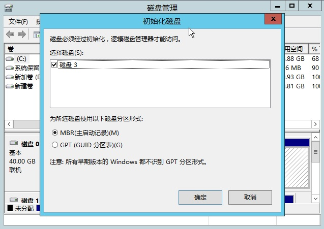
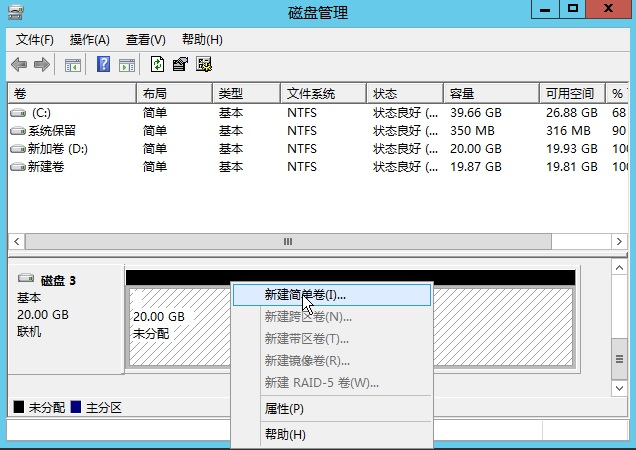
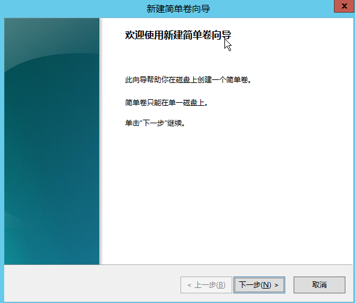
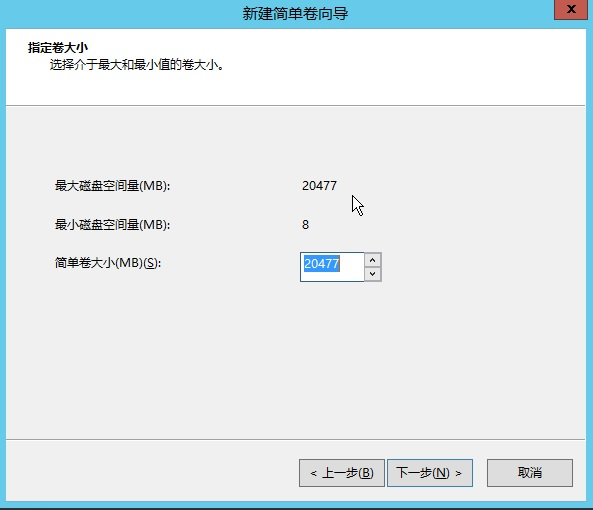
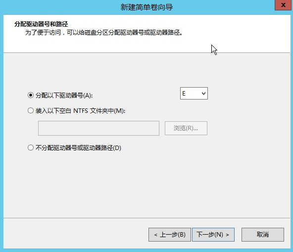
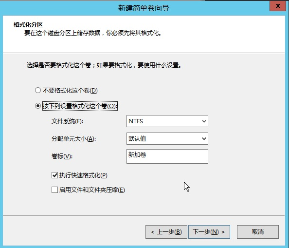
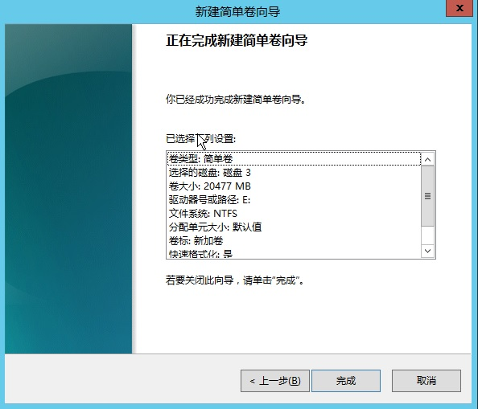
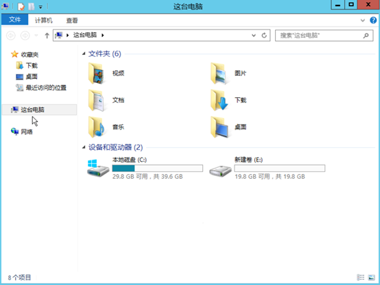

# Create File System
After the console attaches the data disk for the Windows instance, you need to login the instance to partition and format the data disk, and create a file system before you can use the data disk normally.

The following takes the operating system of Windows Server 2012 R2 Standard Edition as an example to describe the specific operating steps:

1. After logging in the Windows instance, right-click [Start] in the lower left corner and select "Disk Management" from the pop-up menu. Select the disk and the corresponding partition form in the disk management window, and then click OK;

2. Select the unallocated disk and right click [New Simple Volume];

3. Click [Next] on the pop-up "New Simple Volume Wizard" pop-up window;

4. Specify the volume size;

5. Set the disk drive letter;

6. Format the disk partition;

7. After confirming the selected configuration, click [Finish] to complete the new volume wizard; or click Back to return and modify the selected settings;

8. After completing the above settings, you can view the newly added cloud disk service on the “My Computer” page.

  [1]: ./images/Getting-Start-Windows-FileSystem-1.png "Getting-Start-Windows-FileSystem-1.png"
  [2]: ./images/Getting-Start-Windows-FileSystem-2.png "Getting-Start-Windows-FileSystem-2.png"
  [3]: ./images/Getting-Start-Windows-FileSystem-3.png "Getting-Start-Windows-FileSystem-3.png"
  [4]: ./images/Getting-Start-Windows-FileSystem-4.png "Getting-Start-Windows-FileSystem-4.png"
  [5]: ./images/Getting-Start-Windows-FileSystem-5.png "Getting-Start-Windows-FileSystem-5.png"
  [6]: ./images/Getting-Start-Windows-FileSystem-6.png "Getting-Start-Windows-FileSystem-6.png"
  [7]: ./images/Getting-Start-Windows-FileSystem-7.png "Getting-Start-Windows-FileSystem-7.png"
  [8]: ./images/Getting-Start-Windows-FileSystem-8.png "Getting-Start-Windows-FileSystem-8.png"