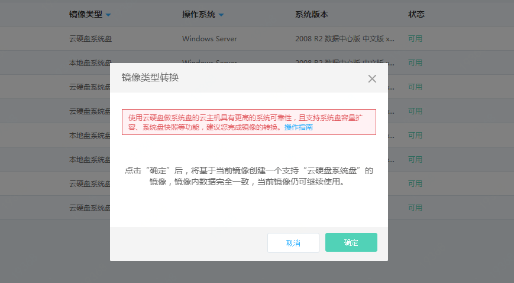

# Image Type Conversion
Since the image formats required for creating a local system disk Virtual Machines and a cloud system disk Virtual Machines are different, if you want to create a cloud system disk Virtual Machines by using a private image made from a local system disk Virtual Machines, you should generate a new image based on the current image through **Image Type Conversion**, and the two images are respectively "Local System Disk" and "Cloud System Disk".

You can view the field "Image Type" in the image lists and details to learn the type of the image system disk, and you can convert the private image as required. The public image and the cloud marketplace image provide two types of images at the same time.

## Precondition

* The conversion operation can only be supported by the private image with the type of "Local System Disk" and the status of "Available";
You must ensure that the private image and cloud disk snapshot quotas are sufficient in the image domain before the operation, because the conversion operation will consume the quotas in the image and cloud disk snapshot.

## Precautions 

* A new image with the same data as the original image but in different types will be created through the conversion operation, and the original image will also remain which could be used to create an instance of the local system disk.
* The conversion operation is unidirectional, thus the "Cloud System Disk" image cannot be reversed to be the "Local System Disk" image.
*A private image that satisfies the criteria can only be converted, if a shared image needs to be converted, please contact the sharing party to perform image conversion and then re-share the new image.
* The conversion operation does not change the status of the source image. But the image cannot be deleted and the conversion request cannot be submitted again until the conversion operation is complete, and the rest of the operations (viewing, information modifying, VM Instance creating, etc.) are not affected.
* A cloud disk snapshot will be generated in the image system disk through conversion operation, with the same name as the image, and it can be viewed in the disk snapshot list; if the original image contains a data disk snapshot, the new data disk snapshot replicas will not be generated in the conversion operation, these snapshots are associated with both new and old images;  a snapshot could be deleted after the two images associated with it are deleted.
* A system disk snapshot generated through image operation can be used as a separate snapshot resource to create a cloud disk. But the snapshot can not be deleted until the image is deleted.

## Operation Steps
1. Access [Image Console][1] to enter the image list page. Or access [JD Cloud Console][2] Click navigation bar on the left **Elastic Compute** - **Virtual Machines** - **Image** to enter the image list page.
2. Select [Private Image] TAB, select the private image needs to be converted (the image type should be the local system disk), and click **Image Type Conversion** in the **More**.>

3. Click **OK** in the confirmation pop-up window to start the image conversion. The names of new image and system disk snapshot are the same as the original image by default, which can be modified after creation.

  [1]: https://cns-console.jdcloud.com/host/image/list
  [2]: https://console.jdcloud.com/
 