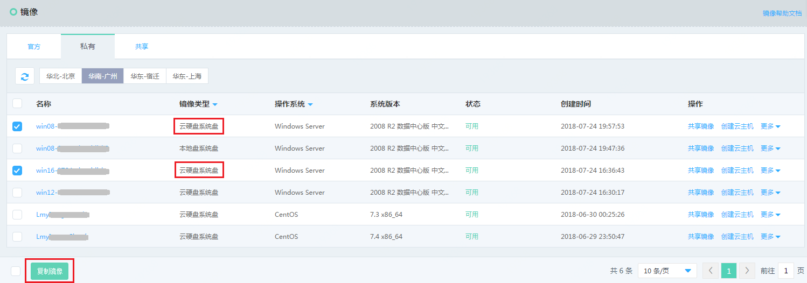
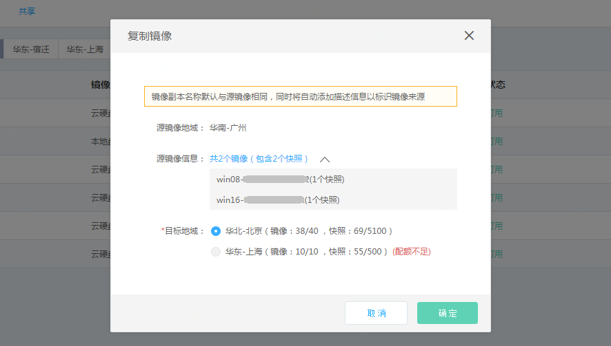

# Image Replication
When a cross-region and consistent business deployment needs to be conducted based on the private image, you can replicate one or more images under one region to a specified region by using the image replication. The time to complete the replication depends on the size of the image, the speed of the network transmission, and the processing of the system's concurrent tasks.

The image replication operation includes, first, it copies the cloud disk snapshot referenced by the image, and then supplements the related reference relationship and image metadata to generate a replica image.

## Precondition
* The replication operation can only be supported by the private image with the type of "Cloud System Disk" and the status of "Available", If you want to replicate the "Local System Disk" private image, please convert it to the "Cloud System Disk" image through [Image Type Conversion](../Operation-Guide/Image/Convert-Image.md) first.
* You must ensure that the quotas in the target region are sufficient before the operation, because the replication operation will occupy the quota of the private image and the cloud disk snapshot in the target region.

## Precautions
* Image replication supports batch operations, and it can replicate up to 5 images in a single operation;
* The target region can only be located in other regions except the current region where the image located, and only one region can be selected for one time;
* In order to identify the source of the replica image, the image name through the replication is the same as the source image by default, and the source image information (source image region and ID) is automatically added in the description;
* The replication operation does not change the status of the source image. But the image cannot be deleted and the replication request cannot be submitted again until the replication operation is complete, and the rest of the operations (viewing, information modifying, VM Instance creating, etc.) are not affected.

## Operation Steps
1. Access [Image Console][1] to enter the image list page. Or access [JD Cloud Console][2] Click navigation bar on the left [Elastic Compute] - [Virtual Machine] - [Image] to enter the image list page.
2. Select [Private Image] TAB, select the private image needs to be replicated (the image type must be the cloud system disk), click [More] - [Image Replication]; or batch to tick no more than 5 images, click [Image Replication] below the list.

3. The confirmation pop-up window will show the number of snapshots included in the source image selected and the quotas for private images and cloud disk snapshots in regions that support replication operations other than the current one. Click [OK] to start the image replication.

4. After the replication task is successfully submitted, the replica image displays a status of "Pending", along with the overall replication progress as a percentage. The replica image name is the same as the source image with description automatically added, which can be modified after creation.
 
 
 
 
 
 ## Related Reference
 
[Image Type Conversion](../Operation-Guide/Image/Convert-Image.md)

  [1]: https://cns-console.jdcloud.com/host/image/list