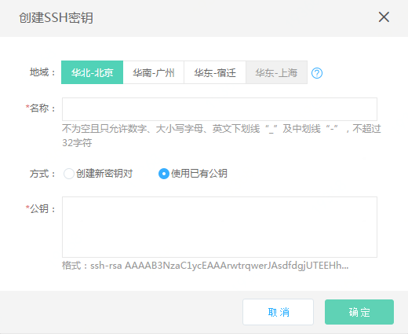

# Create Key Pair

## Operation Steps
1. Access [Key Console][1], or access [JD Cloud Console][2] Click  navigation bar on the left [Elastic Compute] - [Virtual Machine] - [Key Pair] to enter the key pair list page.
2. Select the region where you want to use key pair and click [Create] to start the creation process of key pair.
3. Name the public key pair that will be saved in JD Cloud.
4. Select the creation method of key pair:>
   * Create a new key pair: JD Cloud will create a key pair for you. Among them, JD Cloud saves the public key pair and you save the private key pair. Note that you only have one chance to download the private key pair. Please download the private key pair in time during the link validity period.
   * Use Existing Public Key Pair: Upload your local public key pair file to JD Cloud. When creating in this way, make sure you have a private key pair saved in the local with the public key pair.
5. After the successful creation, you can view the public key pair plaintext in the detailed key pair page.
Note: If you choose to create a new key pair, the console will provide a  interface to download private key pair after creation. Please be sure to save the corresponding private key pair and ensure that the private key pair is not spread on the Internet. JD Cloud will not save your private key pair. The link to download the private key pair is only valid within 10 minutes. Please download it in time.

  [1]: https://cns-console.jdcloud.com/host/ssh/list
  [2]: https://console.jdcloud.com/