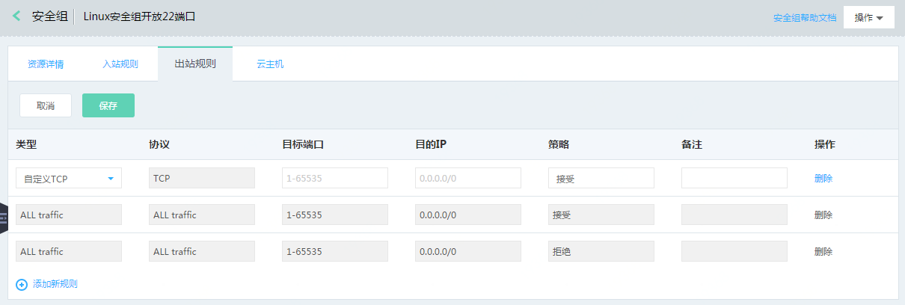

# Configure Security Group Outbound Rules
Outbound rules are used to filter network traffic from Virtual Machines accessing the Internet or other Virtual Machines.

## Precautions
* Security group rules are in the state. If you allow instance to send a request externally by configuring an outbound rule, the response traffic for that request will be allowed to flow regardless of the inbound rule configuration.
## Operation Steps
1. Access [Security Group Console][1], or access [JD Cloud Console][2] click the left navigation bar **Elastic Compute** - **Virtual Machines**- **Security Group** to enter the security group list page and find the security group that needs to be configured with the outbound rules, click **Modify Outbound Rule** in **More** or click the security group name to jump to its details page.

2. Enter the Outbound Rules TAB page and click **Edit Rule** on the page to enter the Outbound Rule Edit page.

3. Click **Add New Rule** at the bottom of the page to add a new outbound rule for the current security group. After you select the outbound rule type, the system will automatically match the corresponding protocol according to the selected outbound rule type, and then set the port in turn. (Support for a single port number, such as 80, also supports port range such as: 80-8080), destination IP (supports a single IP or CIDR), and notes (supports full characters, no more than 256 characters) to complete the configuration of an outbound rule.
4. You can also edit the security group outbound rules that have been added on the page at any time.
5. Click **Delete** in the operate columns to delete a corresponding outbound rule.
6. Click **Save** at the top of the page, and the newly modified security group rule will take effect automatically.

  [1]: ./images/Operation-Guide-SG-outbound1.png "Operation-Guide-SG-outbound1.png"
  [2]: ./images/Operation-Guide-SG-outbound1.png "Operation-Guide-SG-outbound1.png"
  [3]: ./images/Operation-Guide-SG-outbound1.png "Operation-Guide-SG-outbound1.png"
  [4]: ./images/Operation-Guide-SG-outbound2.png "Operation-Guide-SG-outbound2.png"
  [5]: ./images/Operation-Guide-SG-outbound3.png "Operation-Guide-SG-outbound3.png"