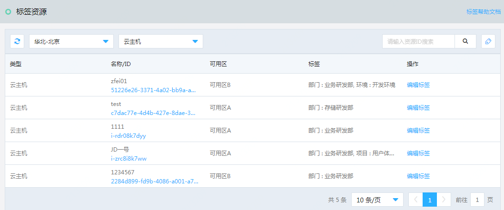
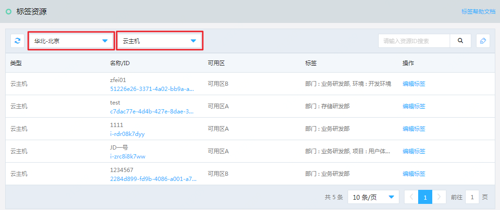
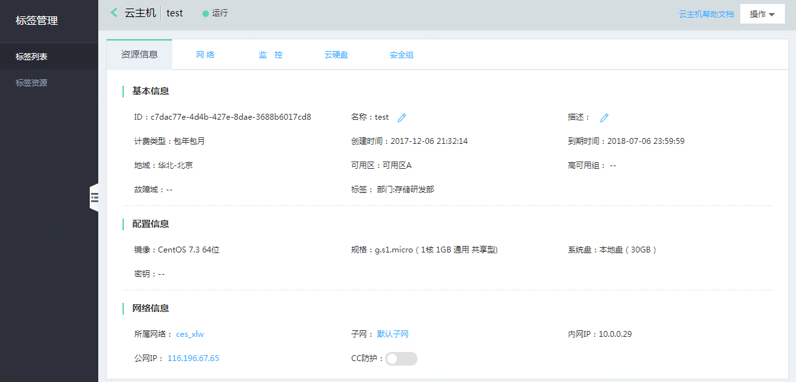

# Operation Guide

## Tagged Resources
In the Tagged Resources, you can see all the resources that have been associated to the tags, including their types, names, IDs, Availability Zones that they belong to, and the information of tag that has been associated.

### Search Resources by ID
You can search a resource by entering the resource ID in the upper right search box of Tagged Resource and find out which tags the resource is associated to.

### Filter Resources by Tags
When you move the mouse over the Tag Filter button at the upper right of the Resource list, the tag filter box expands according to the currently selected region and product type on the left, showing all the tag trees (tag keys and tag values) that have associated resources under the current criteria. You can filter the resources in the list by checking one or more tag keys and values, to get the required resource collection that contains a specific tag.

When multiple tag keys and values are checked as search criteria at a time, tags with different values of the same key are in "or" relationship with each other in the search criteria, and tags with different keys are in "and" relationship with each other in the search criteria.

After filtering, the filter criteria you have selected will appear at the top of the list. You can re-filter by removing some of the tags or completely clear the tag filter criteria.

### Switch Regions/Resources Types
You can switch the regions or product lines where the resource list displays data by the drop-down box at the upper left of the Tagged Resources list.

### Refresh
You can refresh the data in the current resource list by clicking on the Refresh button at the upper left of the tag resource list. Refreshing does not change the existing filtering criteria and provides the latest resource data under this criteria.

### Resource Details
You can enter the details page of the resource by clicking on the resource ID.

### Edit Tag
You can associate or dissassociate the resource to the tag by clicking on the “Edit Tag” button on the right side of each data. When editing a tag, you can perform multiple associating or dissassociating operations, and then click on the “OK” button to complete the associating and dissassociating operations of multiple tags at a time.
You can either select an existing tag to associate to the current resource by the drop-down box, or enter a new tag key and value to create a new tag and associate to the current resource.
The key and value of the tag are not allowed to be null. The leading and trailing spaces are automatically filtered, and multiple spaces contained in name characters are automatically processed into one space.
Each resource can be associated up to 10 tags. Each user can have up to 500 tags. Each tag key can have up to 500 different tag values.

