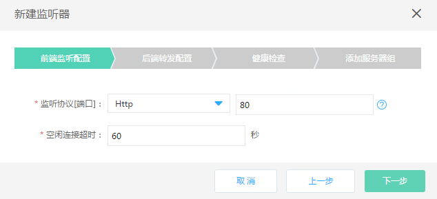
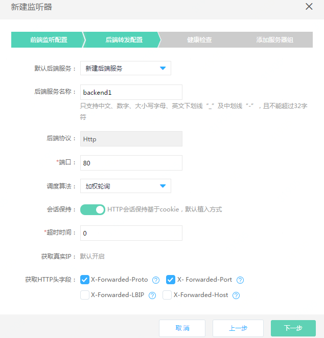

# Create listening policy

1. Enter the listener management page by clicking the Load balancer-Details-Listener;

2. Click Create a listener to open a listener setting page;

3. Listener setting:
	
	Frontend listening configuration:
	
	- Select Frontend Listening Protocol: http, https, tcp; port: 1-65535;	
		Note: The listening port under the same load balancer cannot be duplicated, after creating the listener, the Listening Protocol, port cannot be allowed to modify;	
	- Idle connect timeout: input range 1-86400s;

		

	**Backend forwarding configuration:**

	- Backend service by fault: Create or select an existed backend service, after selecting an existed backend service, relevant parameters cannot be modified;
	
		 Backend service name: define backend service name, backend services created synchronously with listeners can be viewed in the backend service list;	
	
	- Backend Protocol: Display by default, if the listening protocol is http, https, the backend protocol is http, if the listening protocol is tcp, the backend protocol is tcp;
	
	- Port: Backend business forwarding port, input range 1-65535, ports for different backend services can be duplicated;
	
	- Scheduling algorithm: Weighted round robin algorithm, weighted least connection number and source IP can be selected according to actual business needs;
	
		 Session persistence: Off by default, which supports cookie session persistence based on cookie implant method when Backend Protocol is http;	
	
		 cookie timeout: input range 0-86400, default value 0, representing the same life cycle as the browser;	
	
	- Get real IP: It is on by default when Backend Protocol is http, support to pass-through in proxyprotocol Protocol method when Backend Protocol is tcp;
	
		Note: If it is gotten by turning on source IP under tcp protocol, it needs to be separately configured at the server;	
		
	- Get http header field: May select multiple items such as X-Forwarded-Proto, XForwarded-Port, X-Forwarded-LBIP, X-Forwarded-Host for passing-through relevant information requested by client http;

			

	**Health check setting:**

	- Select health check method: HTTP and TCP;
	
	- Set check port: input range 1-65535, if it is not filled in, the port of backend instance for receiving load balancer traffic will be the port by default;
	
	- Response timeout time(s): input range 2-60s, which is the maximum timeout time for health check response;
	
	- Health check interval(s): input range 5-300s, which is the maximum time interval for health check;
	
	- Unhealthy threshold: input range 1-5, which is the number of consecutive health check failures from success to failure of the backend instance;
	
	- Healthy threshold: input range 1-5, which is the number of consecutive health check successes from failure to success of the backend instance;
	
	- Normal state code: input range 2xx (equivalent to 200-299), 3xx (equivalent to 300-399), 4xx (equivalent to 400-499);
	
	- Check path: It only will be filled in when the health check method is HTTP, it must start with “/”, at most support 5-level contents, and cannot exceed 100 characters.

		

	**Add server group: **

	- Select server group type: virtual server, availability group, or it cannot be added currently;
	
		 Virtual server group: The system will automatically filter out the list of server groups that can be associated now, if there is no available server group, it may click “Create a new virtual server group” to create;	
	
		Note: The backend instances in the optional server group must be under the same region, virtual private cloud, and availability zone as the load balancer.

	- Availability Group: The system will automatically filter out the availability groups that can be associated now, if there is no availability group, please go to the Availability Group page to create; note: The backend instances in the optional availability group must be under the same region, virtual private cloud, and availability zone as the load balancer.

		
