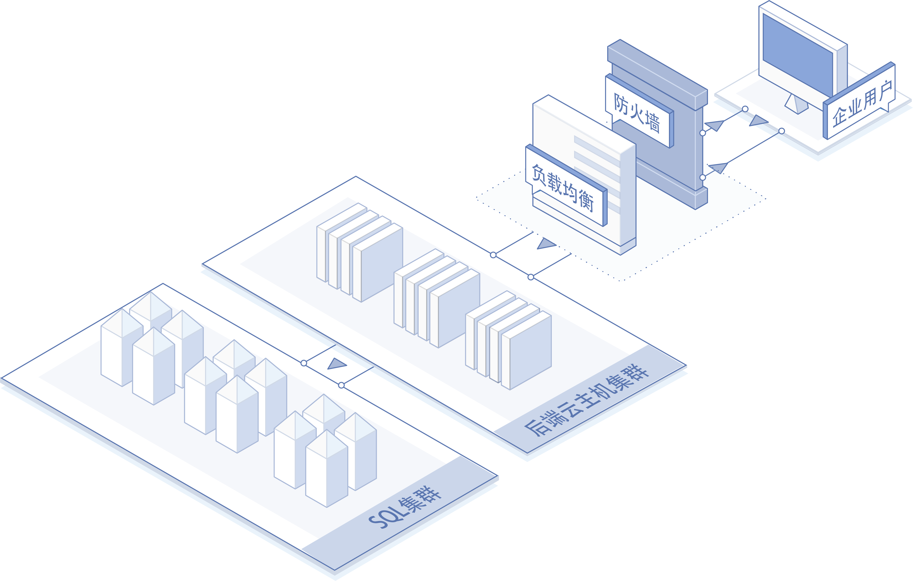
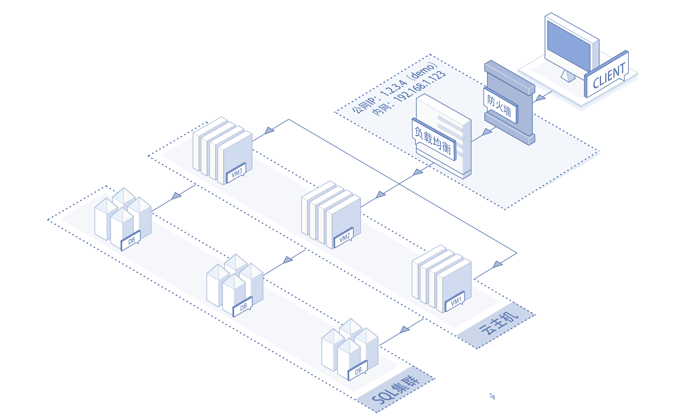
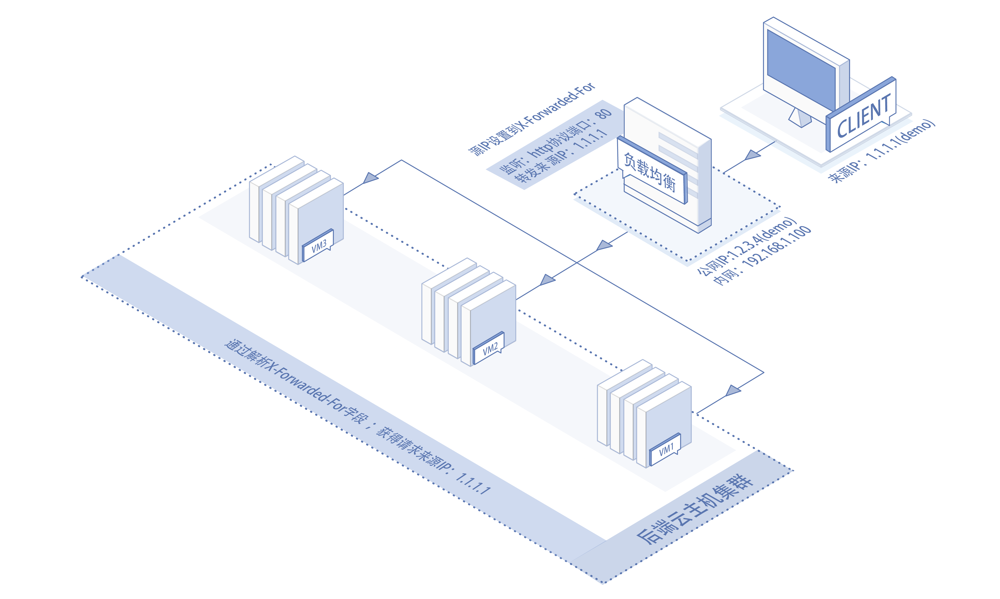
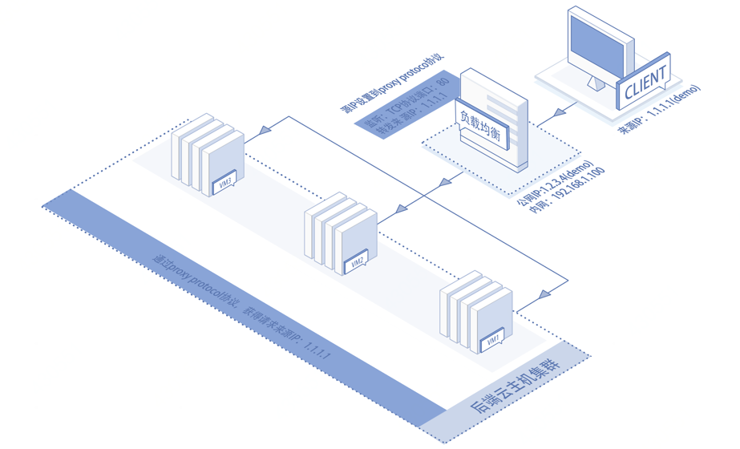
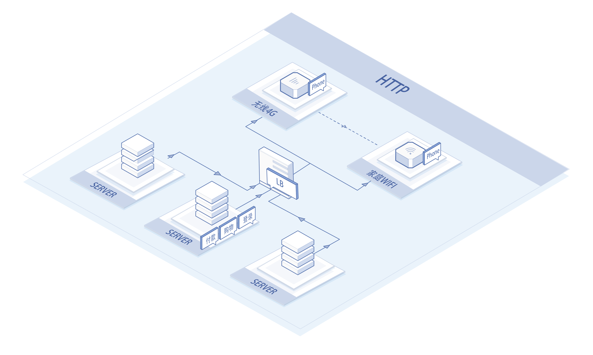

# Application scenario

The following explains scenarios applicable to **load balancer**.

## Elastic expansion scenario
When the load balancer backend is associated with the virtual server group, the traffic will be distributed to multiple sets of backend servers through the load balancer, after being associated with the auto scaling groups, the number of backend servers can be automatically increased, decreased according to the business load to deal with the impact of large traffic and sudden traffic on the system, which can be applied to regular websites, large business websites, seckilling, snap-up or other business systems that can lead to sudden traffic growth.

## Multi-AZ high availability scenario
The load balancer provides multiple high availability security mechanisms, the single instance adopts the cluster for deployment (at least 2 active-active resources) to perform automatic health check to the backend server, if any exception is found, the traffic will not be transferred to the instance, which will be recovered until the instance runs properly; if elastic expansion is required, the backend server can be associated with availability group, the number of backend servers will be increased or decreased automatically according to backend server loads, the availability group will distribute backend servers to different racks so as to avoid system failures due to single rack failure; multiple availability zone services are supported in some regions, if high availability across availability zones is required, load balancers can be created in different availability zones to avoid system failures due to a single availability zone failure so as to improve system reliability and provide customers with higher availability guarantee.

## High security scenario
The load balancer can be configured in Intranet environment, and can provide external services by associating EIP. Therefore, the internal network structure can be concealed, so as to enhance the system security. Besides, due to Intranet deployment, a more secure protection system can be built by setting a security group.

## Customer real IP traceability scenario
Support under HTTP/HTTPS listening protocol to pass source IP information through X-Forwarded-For field; the server identifies X-Forwarded-For to extract customer real IP address. It also supports under TCP listening protocol to pass customer real IP through proxy protocol v1 protocol support. It is convenient to analyze customer source, statistical operation and maintenance data and realize black and white list identity and access management and so on.

HTTP/HTTPS listening:

TCP listening:

## Use containers as backend service scenarios
Load balancer supports to associate the container to distribute traffic as backend service, support the container to be added with uniform virtual server group to perform load sharing so as to provide underlying network architecture support for microservices.

## HTTP Protocol session persistence scenario based on cookie
Load balancer supports HTTP Protocol Session Persistence Service based on cookie. For example: Visit the shopping website through mobile terminal, complete the login and shopping cart addition operation in the home WIFI environment. Due to network signal failure, switch to mobile 4G and continue to complete the payment operation. The first package of message exchange selects the backend server according to the scheduling algorithm (weighted round robin, weighted least connection), and cookie is generated at load balancer at the same time, the message is responded through HTTP and sent to the mobile terminal for storage, the subsequent message is subject to session persistence based on cookie, the load balancer will match the message with the same cookie and forward it to the same backend server. 

## Relevant references

- [Product advantage] (../Introduction/Benefits.md)
- [Product function] (../Introduction/Functions.md)
- [Price overview] (../Pricing/Price-Overview.md)
- [Billing rules] (../Pricing/Billing-Rules.md)
- [Create instance] (../Getting-Started/Create-Instance.md)

