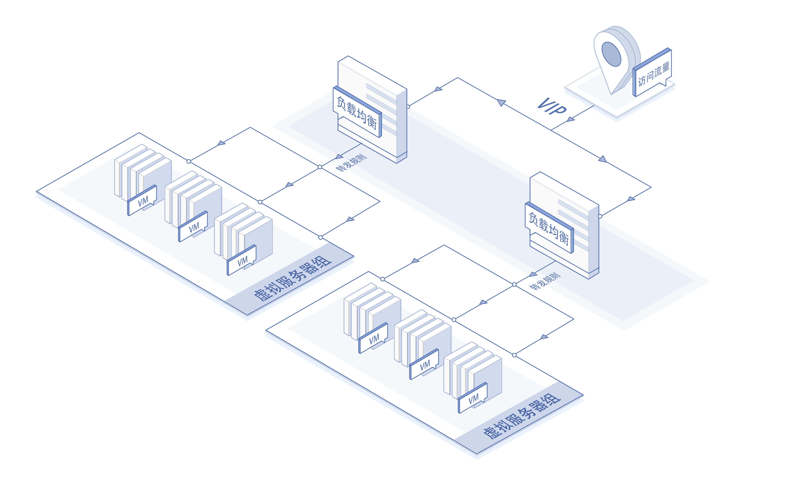
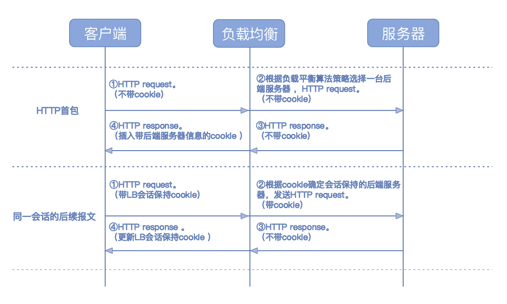

# Basic architecture

- The load balancer provides four-layer and seven-layer load listening service, so as to realize traffic forwarding under TCP Protocol, HTTP Protocol, HTTPS Protocol based on nginx architecture.
- The load balancer adopts cluster for deployment, so as to improve service availability through device redundancy and eliminate device single point failure.

## Components

- Load balancer instance

Before using the load balancer service, it needs to purchase, create load balancer instance, one load balancer instance can be set up with multiple listeners, multiple backend services, multiple virtual server groups, and can be attached with multiple availability groups.

- Listener

Before performing traffic loading, it needs to set up at least one listener, designate the listening protocol/port et.

- Backend service

It is used for providing management module for forwarding, scheduling policy from load balancer to backend server, including forwarding protocol/port, scheduling algorithm, session persistence and forwarding backend server, etc.

- Virtual server group

A set of VM or container resources receiving access request is managed by the virtual server group. The virtual server group can be combined with auto scaling for use so as to realize auto expansion and contraction of VM, but the dispersion capacity of machine of AS is relatively weak, paying no attention to high availability dispersion mechanism across rack dimensions.

- Availability Group

Availability Group is the Virtual Machine logic set provided by JD Cloud, which may support auto scaling across racks, across AZ according to the machine template designated by the user so as to distribute Virtual Machines in dispersion to the physical resources separately isolated. When hardware or power failure occurs, only the Virtual Machines in Availability Group can be affected, the business is still in available status.

## High reusability architecture

- Listeners of multiple different protocol types (HTTP/HTTPS/TCP) can be set under one load balancer, and listeners in the multiple same protocol types but under different server port numbers can be also set;

- Multiple listeners under the same load balancer can be reused to associate with the same backend service;

- Multiple backend services under the same load balancer can be reused to associate with the same backend server group/availability group;

- The same virtual server (machine/container) can be registered to the same virtual server group through different ports;

- The same virtual server (machine/container) can be registered to different virtual server groups;

- The same availability group can be attached to multiple backend services of the same load balancer;

- The same availability group can be attached to backend services of multiple load balancers.

	Note: The virtual server group can be only added with servers that are on the same Virtual Private Cloud as the associated load balancer instance.

## Shunting principles

An external access request is distributed to the backend server by the load balancer instance according to the relevant policies and forwarding rules for processing. At present, the shunting type supported by the load balancer includes: weighted round robin, weighted least connection number and source IP. Round robin means distributing connection request one by one by order to the backend service instance, weighted round robin means distributing the round times according to the weight ratio of instance. The least connection distributes requests according to the minimum number of active connections between load balancer and each backend service instance, the weighted least connection finally guarantees the ratio of the number of active connections between load balancer and backend services to be consistent with the weight ratio. Source IP means hash according to the requested source IP address, distribute requests of different source IPs to different backend service instances.

## Session persistence principles

Session persistence is also called as Sticky Sessions or Session affinity. Session persistence means a functional mechanism on the load balancer, which distributes data while guaranteeing that relevant access requests from the same client can be distributed to the same server.

For the seven-layer HTTP/HTTPS Protocol session persistence, the load balancer is in charge of inserting cookie, there is no need for modification of backend server. When the client makes the first request, HTTP request (without cookie) of the client enters the load balancer, the load balancer selects one set of backend server according to the scheduling algorithm policy and sends the request to the server; HTTP response (without cookie) of the backend server is sent back to the load balancer. Then, the load balancer will insert the HTTP response into cookie (save associated information of backend server) and return the HTTP response to the client.

When the customer request occurs once again, customer HTTP request (with cookie inserted by the last load balancer) enters the load balancer, then, the load balancer reads out the session persistence value in cookie, and sends the HTTP request (with cookie same as above) to the designated server, the backend server responds to the request; because the cookie will not be written in the server, the HTTP response will not carry cookie, when the HTTP response enters the load balancer, the load balancer will write cookie after refresh aging time in the HTTP response and return the HTTP response to the client.

## Relevant references

- [Product advantage](../Introduction/Benefits.md)
- [Product function](../Introduction/Functions.md)
- [Price overview](../Pricing/Price-Overview.md)
- [Billing rules](../Pricing/Billing-Rules.md)
- [Create instance](../Getting-Started/Create-Instance.md)
- [Create virtual server group](../Operation-Guide/TargetGroup-Management.md)
- [Configure listening policy](../Operation-Guide/Listener-Management.md)
- [Manage rear end service and view health status of service instance](../Operation-Guide/Backend-Management.md)
- [View monitoring information](../Operation-Guide/Monitoring.md)

