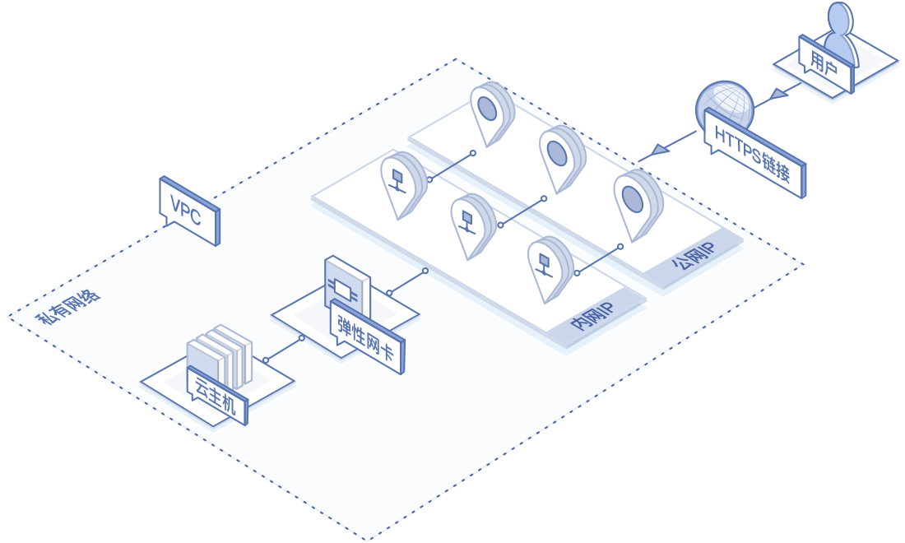
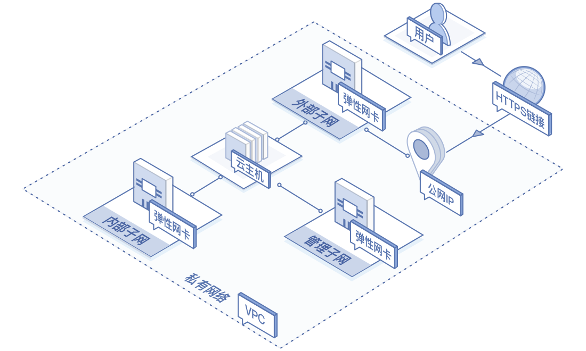

# Application scenario

The Elastic Network Interface is applicable in building application scenarios such as single machine hosts multiple business, business traffic separation, and high availability networks. See the description below for the specific Customer Scenario and descriptions.

## A single Virtual Machine hosts multiple public network business
Since the Elastic Network Interface features multiple IP address, it can support the construction of a scenario where a single Virtual Machine deploys multiple internet businesses. In the case that users provide multiple HTTPS-based web services on the same Virtual Machine, and each security certificate needs to be associated with a specific IP address, the user’s cost can be greatly saved and the resource utilization rate of the Virtual Machine can be improved by adopting this deployment method.  See the following for the scenario architecture:

## Virtual Machine business traffic separation
Business traffic separation and network isolation is one of the most typical application scenarios of Elastic Network Interface. VM can be mounted with several Elastic Network Interfaces belonging to different subnets in the same VPC. Specific network interfaces will host traffic management of intranet, public network and management network in the VM respectively. The access security control policy and the routing policy can be independently set for subnet. Besides, independent Security Group policy can also be configured for Elastic Network Interface, thus realizing network isolation and business traffic separation. See the following for the scenario architecture:

## Solutions for high reliability application
JD Cloud provides an Elastic Network Interface according to the region level, capable of setting up high-availability solutions and providing powerful supports for the user in Availability Zone. Based on keepalived tools, the user can realize disturbance switching of IP or network interface. Under specific context, the user’s Elastic Network Interface is under strong correlation with the security device strategy and the security certificate. In case of a fault, it needs to use the Elastic Network Interface for migration. Under common scenarios, the user can use IP migration to realize disturbance switching. See the following for the scenario architecture:

