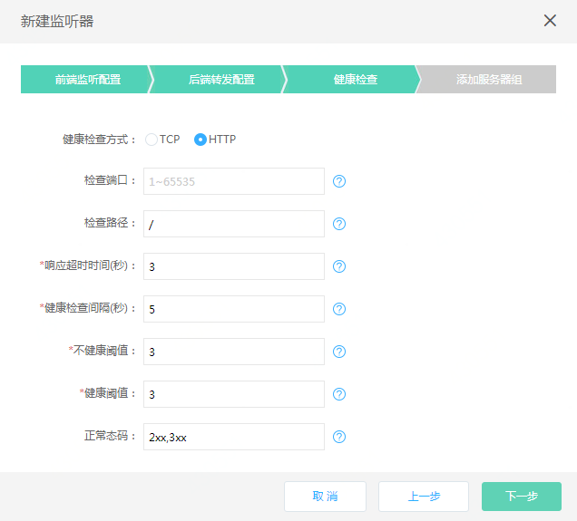
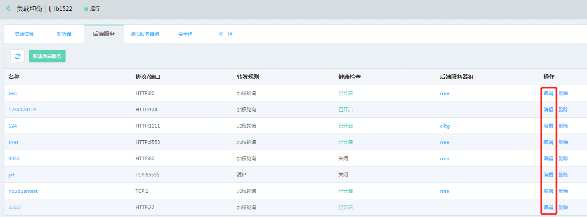
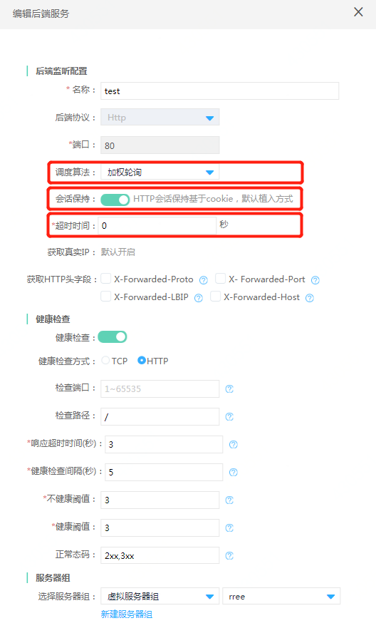

# HTTP listener provides session persistence service based on cookie

## Preparation and planning

- Networking preparation

	Plan for load balancer, and region, availability zone, virtual private cloud, etc. of VM and containers as backend server in advance, according to business deployment needs.
	
	Note: VM and containers as backend server need to be in the same region, virtual private cloud with load balancer.

- Server preparation

	It is necessary to create VM and containers for carrying business traffic in advance, and ensure that the ports needed for listening are opened, and that security groups and ACL policies are properly configured.

- Load balancer instance

	Create a load balancer instance, and set up the region, availability zone, network, security group and other configurations.

## Create an HTTP listener

- Frontend listening configuration:

  Click **Add** to create a listener: select HTTP Protocol, configure listening port, idle connection timeout.

  

- Backend forwarding configuration: May create a new backend service or select an existing backend service, it is noted that backend services of backend HTTP (or HTTPs) type protocol can be selected.

  Create a new backend service: configure backend service name, Protocol (HTTP), port 80, scheduling algorithm selects weighted round robin, turn on/off session persistence switch, set session persistence timeout time.

    ** Only when HTTP (or HTTPs) listening supports backend services of HTTP type, this scenario can support session persistence based on cookie; the session persistence function is related with three configuration items including scheduling algorithm, session persistence switch, timeout time, the session persistence function is off by default, currently, only when the scheduling algorithm is weighted round robin, the session persistence based on cookie can be turned on, when the scheduling algorithm is source IP and weighted least connection, the session persistence based on cookie will not be supported; the configuration scope of session persistence timeout time is 0 to 86400s, the timeout time by default is 0s; at this point, the cookie of session persistence is in the same lifetime of the browser, the browser is closed, the cookie is deleted, the session needs to be rebuilt when the browser is reopened.**

  

- Configure health check: set related parameters of health check, wherein the HTTP method is used here.

- Add server group: Select virtual server group, availability group according to business needs.

  Select virtual server group, availability group according to business needs.

  

- If there is no available virtual server group, click **Create new virtual server group** to create a new virtual server group. VM and containers can be selected to define the port and weight of the instance.

  Note: Only VM and container resources in the same virtual private cloud with load balancer can be selected.

  

- So far, the listener based on the HTTP Protocol has been created and can be viewed in the listener list.

  

# Modify configuration to support HTTP listener policy of session persistence

## Modify backend service to support session persistence

- Backend service entered in load balancer instance

	From load balancer instance->specific instance name->backend service->edit
  
     

- Modify backend service configuration

	Find specific backend service name at the backend service, click **Edit** from **Actions** to turn on session persistence function. Only the backend service of HTTP type can provide session persistence service based on cookie. The session persistence function is related with three configuration items including scheduling algorithm, session persistence switch, timeout time: currently, only when the scheduling algorithm is weighted round robin, the session persistence based on cookie will be supported, when the scheduling algorithm is source IP and weighted least connection, the session persistence based on cookie will not be supported. The configuration scope of session persistence timeout time is 0 to 86400s, the timeout time by default is 0s; at this point, the cookie of session persistence is in the same lifetime of the browser, the browser is closed, the cookie is canceled, the session needs to be rebuilt when the browser is reopened.

   

