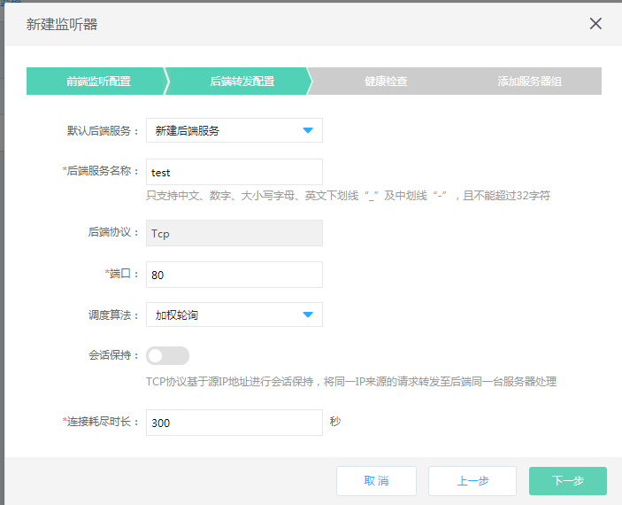
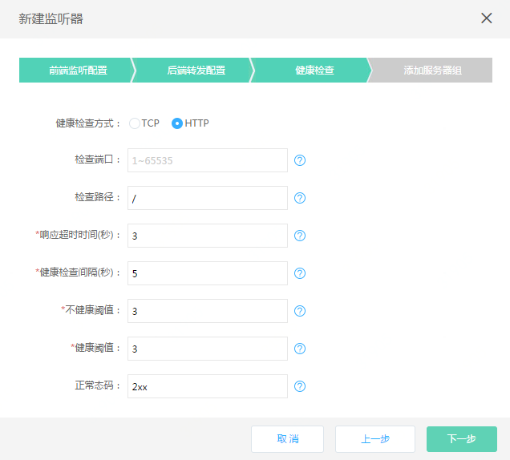
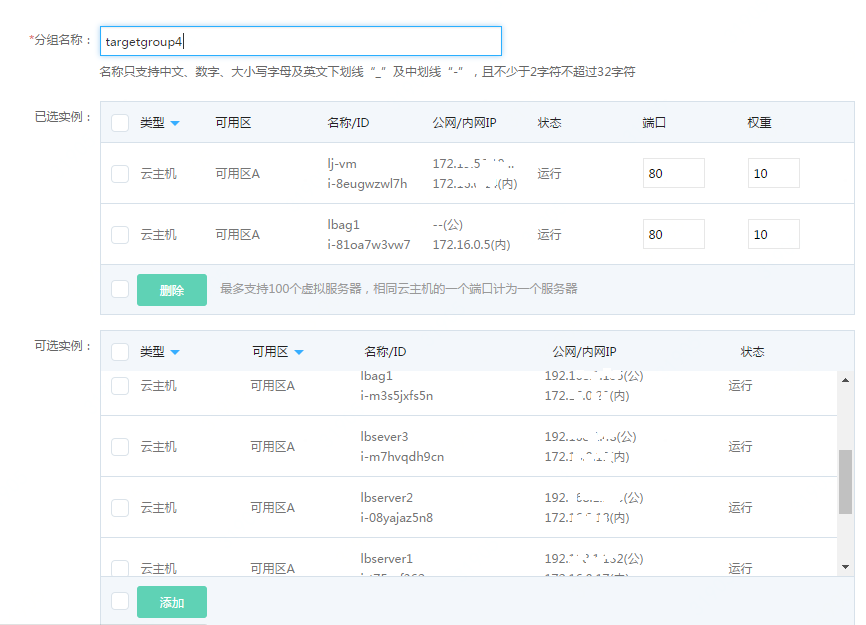

# Deploy the TCP listener policy supporting connection draining

## Preparation and planning

- Network Preparation

  Plan for load balancer and region, availability zone, virtual private cloud, etc. of VM, containers as backend server in advance, according to business deployment needs 【Note: VM, containers as backend server need to be in the same region, virtual private cloud with load balancer】.

- Server Preparation

  It is necessary to create VM and containers for carrying business traffic in advance, and ensure that the ports needed for listening are opened, and that security groups and ACL policies are properly configured.

- Load Balancer Instance

  Create a load balancer instance, and set up the region, availability zone, network, security group and other configurations.

## Create a TCP listener

- Frontend listening configuration:
	
  Click **Add** to create a listener: select TCP Protocol, configure listening port, idle connection timeout.
  

- Backend forwarding configuration: May create a new backend service or select an existing backend service, it is noted that only backend services of backend TCP type protocol can be selected.
  
  Thus, create a new backend service: configuring backend service name, protocol (TCP), and port 80, weighted round robins as scheduling algorithm, and session persistence enabling and disabling.
  
  ** In addition, pay special attention to connection draining and the setting of timeout period. When a server is removed from the "virtual server group" or the availability group (AG), only the established TCP connection packet will continue to be forwarded to the server until the connection draining time expires. So far, the newly established TCP connection will not be forwarded to the server.**
  
  

- Configure health check: set related parameters of health check, wherein the TCP method is used here.
 

- Add server group: Select virtual server group, availability group according to business needs.
   
   Select virtual server group, availability group according to business needs;
  

- If there is no available virtual server group, click **Create New Virtual Server Group** to create a new virtual server group. VM and containers can be selected to define the port and weight of the instance 【Note: only VM, container resources in the same virtual private cloud with load balancer can be selected】.
  
   

- So far, the listener based on the TCP Protocol has been created and can be viewed in the listener list.

# Modify configuration to support TCP listener policy of connection draining

## Modify the connection draining of backend service

- Backend service entered in load balancer instance
  
  From load balancer instance->specific instance name->backend service->edit
  
  

- Modify backend service configuration
  
  Find specific backend service name at the backend service, and click “Edit” under “Actions” to set the timeout period for session persistence. When a server is removed from the "virtual server group" or the availability group (AG), only the established TCP connection packet will continue to be forwarded to the server until the connection draining time expires. So far, the newly established TCP connection will not be forwarded to the server.
  
  If the function of connection draining is not required, the duration may be set as 0.
  
  
