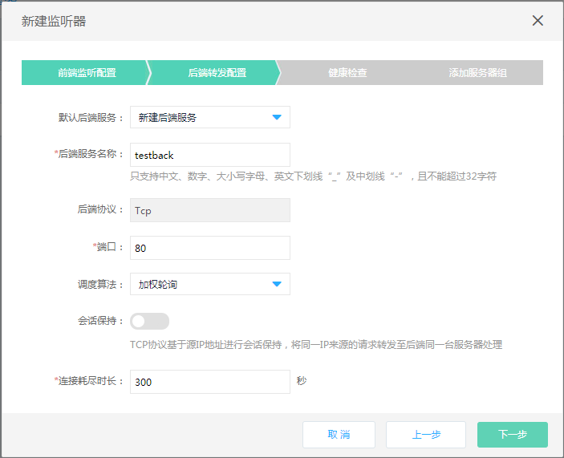
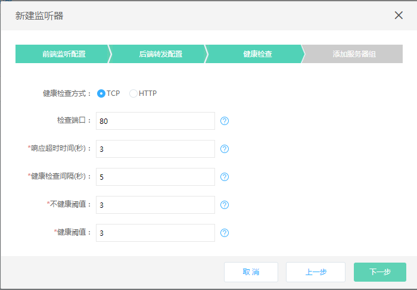
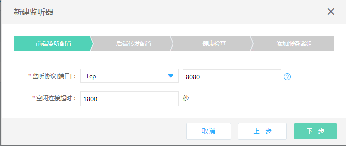

# Quickly deploy multiple listeners based on the same business

  If your business needs to support multiple listeners at the same time and use backend the service, quick deployment may be achieved in the following methods.

## Preparation and planning

- Network Preparation

  Plan for load balancer and region, availability zone, virtual private cloud, etc. of VM, containers as backend server in advance, according to business deployment needs 【Note: VM, containers as backend server need to be in the same region, virtual private cloud with load balancer】.	
 
- Server Preparation

  It is necessary to create VM and containers for carrying business traffic in advance, and ensure that the ports needed for listening are opened, and that security groups and ACL policies are properly configured.

- Load Balancer Instance

  Create a load balancer instance, and set up the region, availability zone, network, security group and other configurations.

## Create a listener policy of TCP Protocol

#### 1. Frontend listening configuration:
	
- Configure listening protocol as TCP, Port 80;

- Idle connection timeout: set idle connection timeout time.

#### 2. Backend forwarding configuration:
	
- Default backend service: select to create a new backend service;

- Backend service name: define backend service name; name it as “testback”;

- Backend Protocol: display the corresponding default protocol according to the Listening Protocol

- Port: define backend forwarding port;

- Scheduling algorithm: select according to business needs, and specify it as weighted round robin here;

- Session persistence: enable;

- Connection draining: set the connection draining timeout period;

- Configure health check: Select health check method as: TCP.

#### 3. Add server group:

- Select virtual server group, availability group according to business needs;

- If there is no available virtual server group, click **Create New Virtual Server Group** to **create a new virtual server group.

- VM and containers may be selected to define the port and weight of the instance 【Note: only VM, container resources in the same virtual private cloud with load balancer can be selected.

#### 4. The creation of listener policy has been completed:

- The listener based on TCP Protocol may be viewed in the listener list.

- At this point, a resource named "testback" has been created synchronously in the backend service list.

## Reuse backend service to create another TCP listener

#### 1. Frontend listening configuration:

- Configure frontend listening protocol as TCP, Port 8080;

- Set idle connection timeout time.

#### 2. Backend service forwarding;

- Select the use of existing backend service: testback 【Note: Use relevant information of the already existed backend directly and reuse the same backend service configuration, health check, and server group same as the previous TCP listener】.

#### 3. Multiple listeners that reuse the same backend services can be quickly created and reused through this method.

  Note: Please confirm that the business scenario can reuse all configurations of the backend services, such as the same backend forwarding port, etc.

