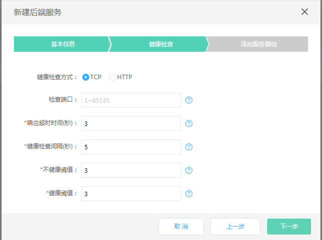
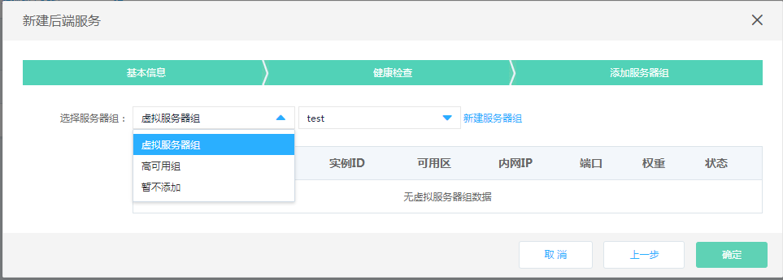
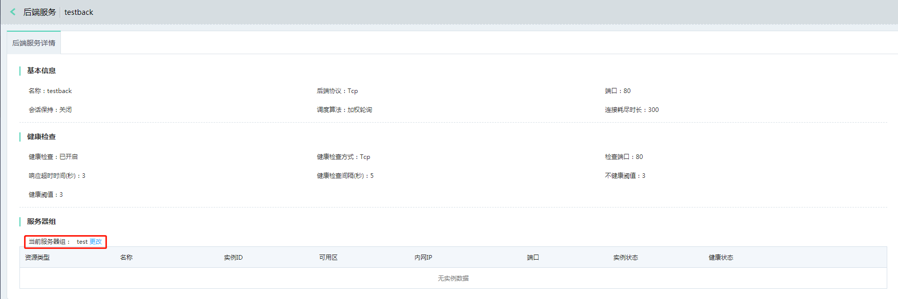
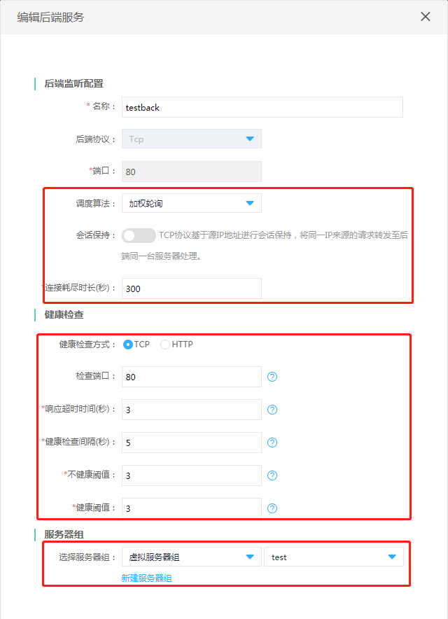

# Backend service management

## Add backend service

#### 1. Enter the backend service management page by clicking the Load balancer-Details-Backend service;

#### 2. Click **Create a new backend service**, turn on backend service creation page;

#### 3. Backend service setting:
	
##### Basic Information:
	
- Name: define backend service name;
	
- Backend protocol: optional tcp 【note: if the backend protocol is tcp, only the listener with tcp listening protocol can be associated】;

- Port: The input range is 1-65535 and ports for different backend services can be duplicated;

- Scheduling algorithm: Support weighted round robin algorithm, weighted least connection number and source IP;

- Session persistence: it is closed by default, open to support the TCP-based session persistence, and the default is 1440 seconds;

- Connection draining: Configure the connection draining timeout period, the range is [0, 3600] seconds, and the default is 300 seconds.

##### Health check setting:

- Select health check method: HTTP, TCP;

- Set check port: input range 1~65535, if it is not filled in, the port of backend instance for receiving load balancer traffic will be the port by default;

- Response timeout time(s): input range 2~60s, which is the maximum timeout time for health check response;

- Health check interval(s): input range 5~300s, which is the maximum time interval for health check;

- Unhealthy threshold: input range 1~5, which is the number of consecutive health check failures from success to failure of the backend instance;

- Healthy threshold: input range 1~5, which is the number of consecutive health check successes from failure to success of the backend instance;

- Normal state code: input range 2xx (equivalent to 200-299), 3xx (equivalent to 300-399), 4xx (equivalent to 400-499);

- Check path: It only will be filled in when the health check method is HTTP, it must start with “/”, at most support 5-level contents, and cannot exceed 100 characters.

  	

##### Add server group:

- Select server group type: virtual server, availability group, or it cannot be added currently.

- Virtual Server Group: The system will automatically filter out the virtual server group list that can be associated now, if there is no virtual server group, please click the **Create Virtual Server Group** to create; [Note: The backend instances in the optional virtual server group must be under the same region, virtual private cloud and availability zone as the load balancer.] ;

- Availability Group: The system will automatically filter out the availability groups that can be associated now, if there is no availability group, please go to the Availability Group page to create} 【Note: The backend instances in the optional availability group must be under the same region, virtual private cloud, and availability zone as the load balancer.】 .

  

## Backend Service Management

#### 1. View details of backend service: Click the backend service name to enter into the backend service details, view backend service configuration information and replace the associated backend server group (refer to the text below);

#### 2. View associated server group: Click the backend service name in the list page and view server group information and health status related to the backend service;

#### 3. Edit backend service: Edit relevant configuration information of the backend server (refer to the text below);

#### 4. Delete backend service: Once the backend service is successfully deleted, the backend service will be automatically disassociated with the server group, but the backend service associated to the listener cannot be deleted.

  
	
## Replace server group associated to the backend service

#### 1. Open the backend service details by clicking Load balancer-Details-Backend service-Details. Click **Change** to change the associated server group;

#### 2. Open the backend service editing page by clicking the Load balancer-Details-Backend service-Edit and change the associated server group;

  
	
## Edit backend service

#### 1. Open the backend service editing page by clicking the Load balancer-Details-Backend service-Edit;

#### 2. Edit backend service configuration item, in which the backend protocol and the port are unable to be edited and the other items are with editable certificates: such as the associated certificate for the listener. Such certificate can be modified;

  
	

